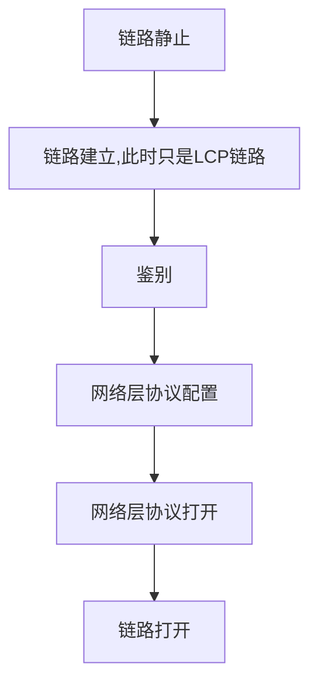

## 计算机网络的性能

### 常见指标

速率

- 每秒传输的比特数40Gbit/s

带宽

- 信号具有的频带宽度，即频率范围
- 某通道的最高传输速率

吞吐量

- 某个网络的单位时间内实际的数据量

时延

- 发送时延：发送数据所需时间
- 传播时延：在信道上传播的时间
- 处理时延：主机或路由器收到数据时处理的时间
- 排队时延：等待处理时需要的排队时间

时延带宽积

- 传播时延 * 带宽
- 表示发送的第一个字节到达时，已经发送了多少数据

往返时间

- A端发送到B端后，再接收到B端数据的时间

利用率

- $$
  网络时延 = \frac{网络空闲时延}{1-网络利用率}
  $$

## 计算机网络分层

### 简单的分层概念

- 应用层（各种应用层协议）
  - 计算机进程交互
- 运输层
  - 负责数据传输
  - 接受应用层的报文
  - 把报文传递给应用层
  - TCP协议
  - UDP协议
- 网络层
  - 把报文封装成`包`
  - 选择合适的路由
- 数据链路层
  - 把报文封装成`帧`
- 物理层

## 物理层

### 通信方式

- 单工通信
- 半双工通信
- 全双工通信

### 信号调制

因为基带信号有较多的低频成分和直流成分，信道能不能传输这些成分，所以要对基带信号调制

- 基带调制

  对波形进行转换，使其与信道特性相符，仍然是基带信号

- 带通调制

  把基带信号的频率范围搬到较高的频段，并转换为模拟信号，称为`带通信号`

### 干扰

- 信噪比-奈氏公式 S=信号平均功率 N=噪声平均功率
  $$
  信噪比=10\log10(S/N)(dB)
  $$

- 信道极限信息传输速率C 

  - W=信道带宽
  - S=信号平均功率
  - N=平均高斯噪声功率

  $$
  C = W\lg(1+S/N)(bit/s))
  $$

### 传输媒体

- 引导性
  - 双绞线
  - 同轴电缆
  - 光缆
    - 利用`低折射率`材料包裹`高折射率`材料，导致光全反射信号只在内部无损耗传播
- 非引导性（无线）
  - 短波通信-靠电离层反射
  - 微波通信
    - 地面微波接力
    - 卫星反射

### 信道复用

- 频分复用
  - 跟用户占用`频带`撑大带宽
- 时分复用
  - 一个周期扫描一个信号
- 波分复用
- 码分复用

## 数据链路层

### 三个基本问题

- 封装成帧
  - 给数据添加首部和尾部
- 透明传输
  - 帧的`SOH`和`EOT`代表开始和结束
  - 如果非ASCII编码的，可能会在数据中出现这两个字符，解决的办法是添加转义字符
- 差错校验
  - CRC循环冗余校验
  - `无比特差错`和`无传输差错`的区别

### 点对点信道通信

- 将网络层交下来的数据封装成帧

### 点对点协议PPP

是计算机连接到`ISP`时`数据链路层`所使用的协议

- 建立连接过程

