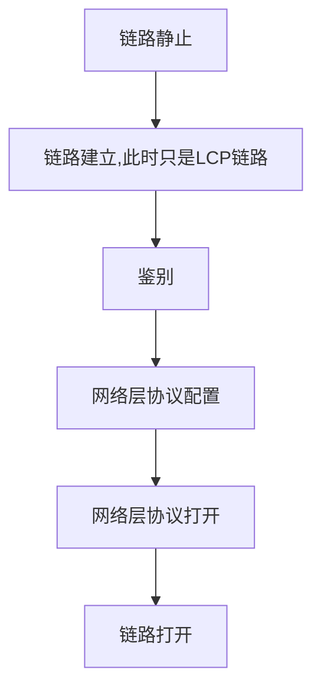

## 计算机网络的性能

### 常见指标

速率

- 每秒传输的比特数40Gbit/s

带宽

- 信号具有的频带宽度，即频率范围
- 某通道的最高传输速率

吞吐量

- 某个网络的单位时间内实际的数据量

时延

- 发送时延：发送数据所需时间
- 传播时延：在信道上传播的时间
- 处理时延：主机或路由器收到数据时处理的时间
- 排队时延：等待处理时需要的排队时间

时延带宽积

- 传播时延 * 带宽
- 表示发送的第一个字节到达时，已经发送了多少数据

往返时间

- A端发送到B端后，再接收到B端数据的时间

利用率

- $$
  网络时延 = \frac{网络空闲时延}{1-网络利用率}
  $$

## 计算机网络分层

### 简单的分层概念

- 应用层（各种应用层协议）
  - 计算机进程交互
- 运输层
  - 负责数据传输
  - 接受应用层的报文
  - 把报文传递给应用层
  - TCP协议
  - UDP协议
- 网络层
  - 把报文封装成`包`
  - 选择合适的路由
- 数据链路层
  - 把报文封装成`帧`
- 物理层

## 物理层

### 通信方式

- 单工通信
- 半双工通信
- 全双工通信

### 信号调制

因为基带信号有较多的低频成分和直流成分，信道能不能传输这些成分，所以要对基带信号调制

- 基带调制

  对波形进行转换，使其与信道特性相符，仍然是基带信号

- 带通调制

  把基带信号的频率范围搬到较高的频段，并转换为模拟信号，称为`带通信号`

### 干扰

- 信噪比-奈氏公式 S=信号平均功率 N=噪声平均功率
  $$
  信噪比=10\log10(S/N)(dB)
  $$

- 信道极限信息传输速率C 

  - W=信道带宽
  - S=信号平均功率
  - N=平均高斯噪声功率

  $$
  C = W\lg(1+S/N)(bit/s))
  $$

### 传输媒体

- 引导性
  - 双绞线
  - 同轴电缆
  - 光缆
    - 利用`低折射率`材料包裹`高折射率`材料，导致光全反射信号只在内部无损耗传播
- 非引导性（无线）
  - 短波通信-靠电离层反射
  - 微波通信
    - 地面微波接力
    - 卫星反射

### 信道复用

- 频分复用
  - 跟用户占用`频带`撑大带宽
- 时分复用
  - 一个周期扫描一个信号
- 波分复用
- 码分复用

## 数据链路层

### 点对点信道三个基本问题

- 封装成帧
  - 给数据添加首部和尾部
- 透明传输
  - 帧的`SOH`和`EOT`代表开始和结束
  - 如果非ASCII编码的，可能会在数据中出现这两个字符，解决的办法是添加转义字符
- 差错校验
  - CRC循环冗余校验
  - `无比特差错`和`无传输差错`的区别

### 点对点信道通信

- 将网络层交下来的数据封装成帧

### 点对点协议PPP

是计算机连接到`ISP`时`数据链路层`所使用的协议

- 建立连接过程

### 广播信道

### 网络适配器

- 俗称`网卡`
- 和局域网`串行`传输数据
- 和计算机总线`并行`传输数据

### 局域网

- 即以太网
- 以下问题建立在10Mbit/s的数据率下讨论
- 多主机随机发送数据，使用CSMA/CD载波监听协议来解决冲突
  - ` 电磁波在1km电缆的传播时延为5us`
  - 传播的争用期为2r，r是单程端到端的时间
  - 10Mbit/s的传播速率，的争用期为51.2us，即在争用期内传播了512bit
  - 最小帧长度为64字节即512bit，不足就填充，即不能是帧太短小于`争用期`传播的数据

### 以太网交换机

- 是`以太网`在`数据链路层`的扩展
- 本质是一个`多个接口的网桥`
- 特点
  - 独占传输媒体，无碰撞的传输数据
  - 自学习功能，自学习`MAC地址`，即插即用
  - `全双工通信`
- 工作在`数据链路层`
- 基于帧的`MAC地址`进行帧转发

## 网络层

### 网际协议IP

- 配套使用协议
  - 地址解析协议ARP
  - 网际控制报文协议ICMP
  - 网际组管理协议iGMP
- 网络互联的中间设备
  - 物理层中间设备叫做`转发器`
  - 数据链路层中间设备叫做`网桥`
  - 网络层中间设备叫做`路由器`
  - 网络层以上使用的中间设备叫做`网关`

### 网络分类

- 网络号全0是保留地址，127是本地回环测试
- 主机号全0是本地主机，全1是所有主机
- A类
  - 0开头
  - 1个字节网络号3字节主机号
  - 第一个网络号1，最后一个网络号126
  - 可用网络号为 126个，减去全0和127
  - 最大主机数为2^24 - 2 即16777214
- B类
  - 10开头
  - 2个字节网络号2字节主机号
  - 第一个网络号128.1，最后一个网络号191.255
  - 可用网络号为2^14 -1，128.0.0.0不指派
  - 最大主机数2^16 - 2，减去全0和全1主机号
- C类
  - 10开头
  - 3个字节网络号1字节主机号
  - 第一个网络号192.0.1，最后一个网络号223.255.255
  - 可用网络号为2^21-1，192.0.0.0不指派
  - 最大主机数2^8 - 2，减去全0和全1

### IP地址和硬件MAC地址

- 对于网络层来说始终只有源IP地址和目的ip地址
- 对于数据链路层来说，是不同的路由器不断跳转改变源MAC地址和目标MAC地址

### IP层转发分组的流程

- 本质是路由之间的不断下跳，都是间接交付，只有到达最后一个路由器时才试图向目的主机进行直接交付
- 分组转发算法
  - 从数据包首部提取`目的主机IP`D和`目的网络`N
  - 若N就是直接与路由器相连，直接交付，否则下一步
  - 若路由表中有D，则下跳路由器，否则下一步
  - 若路由表中有N，则下跳路由器，否则下一步
  - 若路由表中有默认路由，则下跳路由器，否则下一步
  - 出错

### 子网划分

- 即再从主机号中分隔出子网号
- 网络号：子网号：主机号
- CIDR记法（无分类域间路由）
  - 网络前缀/主机号
  - 206.0.68.0/22
  - 可用主机号2^10 = 1024
  - 最小地址为206.0.68.0
  - 最大地址为206.0.71.255
  - 使用`线索二叉树`遍历路由表

### 网际控制报文协议ICMP

- 允许主机或路由器报告差错情况和提供有关异常情况的报告
- tracerout工作原理
  - 给定一个目的IP D
  - 设置TTL为1开始 发送无法交付的UDP报文至目的D
  - 中间的路由器收到后会减TTL为0并发送给源主机超时ICMP
  - 然后TTL+1 如此循环
  - 到D时TTL仍未1说明到达终点，发送重点不可达ICMP给源主机

### 互联网路由选择协议

- 内部网关IGP
  - RIP
    - 方便简单
    - 小型网络
    - 最大下跳距离为16
    - 好消息传得快，坏消息传得慢
  - OSPF
- 外部网关EGP
  - BGP

### IPV6

### IP多播	

- 使用D类地址
- D类IP地址和以太网地址的低23位映射
- 所以多个IP能映射到同一个以太网地址
- 网际组管理组协议IGMP
- 多播转发协议

### 虚拟专用网VPN和网络地址转换NAT

- 相当于内网
- 以下地址不进行转发
- 10.0.0.0到10.255.255.255
- 172.16.0.0到172.31.255.255
- 192.168.0.0到192.168.255.255
- 内网和外网通信需要NAT路由器

### 多协议标记转换MPLS